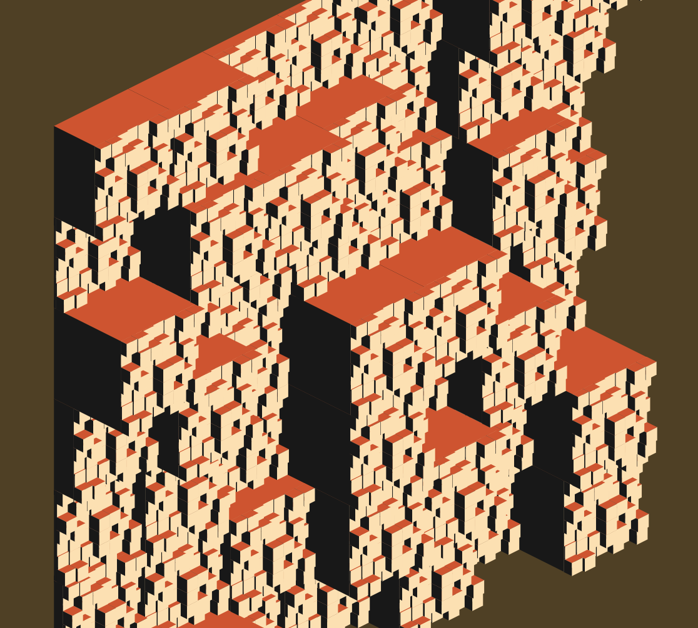

# Escher

This demo is inspired by Escher's Metamorphosis II, specifically by the part the blocks that become the city of Atrani. I also chose colors similar to what Escher used in his print.

In the code I refer to each block as a "house". Each house is a cube centered around a certain x,y,z coordinate, as you can see in the diagram below:

Each house cube has actually only three sides, since those are the only sides that appear to the camera.

## First iteration

My initial idea was to create a grid of houses and keep zooming in forever, creating some kind of fractal in the process. This is what I came up with in my first iteration:

The front wall of the center house is where the fractal part comes in. Like all other houses, that house keeps bouncing in and out of the grid. At some point, though, its front wall would fragment into smaller houses and that would trigger the next fractal level.

I even thought about having that fragmentation process occuring in all houses, but that would certainly not scale well:

This first iteration proved not to be that good. Something undesirable happens when the camera starts to get too close of the center house: nearby houses get in front of the center house, making it disappear. That would be solved by creating a near culling plane where everything coming before that plane would not be rendered.

But another thing would have to be fixed: since the center house keeps bouncing like the others and the camera wants to zoom in to its front wall, we have to translate the camera to follow the front wall movement as well. In practice, the front wall has to be always at the center of the screen.

## Second iteration

The first iteration was becoming too complex and the final visualization wasn't coming out as I expected, so I decided to study Escher's woodcut once more.

One thing I noticed was that my initial approach treated houses like if they were in a grid, but the original cube composition is actually a pyramid.

The pyramid is good for what I want since there's no way a house will get in front of another.

Things to try:

- organize houses in a pyramid composition
- stop all the bouncing; houses emerge from the ground to their final positions and then stay there. As the camera zooms in, at some point the next level of houses will appear from the roof of the center house.

## Third iteration

The camera starts at (0, 0, 1) facing the center. A beige screen appears and then the print projection starts. Some moments later, the camera starts to rotate around the center in the y axis, revealing that what appeared to be a wall is actually a pyramid of cubes.
